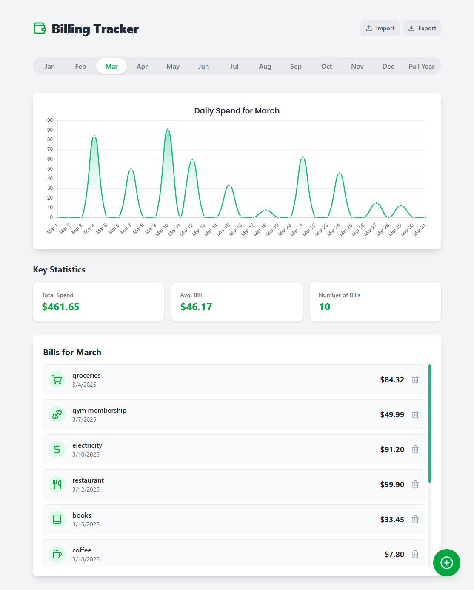

# 📊 Billing Tracker - React & Vite Edition


A sleek and responsive web application designed to help you effortlessly manage and visualize your monthly and yearly expenses. Built with modern web technologies, this app provides an intuitive interface for tracking bills, analyzing spending habits with interactive charts, and keeping your financial data organized.

---

### 📸 Application Preview

*Assuming `pic.png` is in a public or assets folder. If it's in `src`, you may need to move it for it to be visible on GitHub.*



---

## ✨ Key Features

- **Intuitive Bill Management:** Easily add new bills with details like name, amount, date, and a descriptive icon.
- **Dynamic Data Visualization:** Interactive line charts provide a clear view of your spending, with options to toggle between daily statistics for a selected month or an overview of the entire year.
- **Monthly & Yearly Views:** Seamlessly switch between a detailed view of a specific month and a high-level summary of your annual expenses.
- **Key Statistics:** At-a-glance cards show your total spend, the number of bills, and the average bill amount for the selected period.
- **Data Persistence:** Your billing data is automatically saved to your browser's `localStorage`, so your information is there when you return.
- **Import & Export:** Easily back up your data by exporting it as a JSON file, or import existing data to get started quickly.
- **Fully Responsive:** A clean, mobile-first design ensures a great user experience on any device, from desktops to smartphones.

---

## 🛠️ Tech Stack

- **Framework:** [React](https://react.dev/)
- **Build Tool:** [Vite](https://vitejs.dev/)
- **Styling:** [Tailwind CSS](https://tailwindcss.com/)
- **Charts:** [Chart.js](https://www.chartjs.org/) with [react-chartjs-2](https://react-chartjs-2.js.org/)
- **Icons:** [Lucide React](https://lucide.dev/)

---

## 🚀 Getting Started

To get a local copy up and running, follow these simple steps.

### Prerequisites

You need to have [Node.js](https://nodejs.org/) (version 14 or later) and `npm` installed on your machine.

### Installation

1.  **Clone the repository:**
    ```sh
    git clone [https://github.com/your-username/billing-tracker.git](https://github.com/your-username/billing-tracker.git)
    cd billing-tracker
    ```

2.  **Install NPM packages:**
    This will install all the necessary dependencies for the project.
    ```sh
    npm install
    ```

3.  **Run the development server:**
    This command starts the Vite development server, usually on `http://localhost:5173`.
    ```sh
    npm run dev
    ```

You should now be able to view and interact with the application in your web browser!

---

## 📁 Project Structure

The project follows a standard Vite + React structure, with components and utilities organized for clarity and scalability.


billing-tracker/
├── public/
├── src/
│   ├── components/      # Reusable React components (Header, BillList, etc.)
│   ├── utils/           # Helper functions, icon maps, and chart configurations
│   ├── App.jsx          # Main application component and state logic
│   ├── index.css        # Tailwind CSS directives and global styles
│   └── main.jsx         # Application entry point
├── package.json
├── tailwind.config.js   # Tailwind CSS configuration
└── vite.config.js       # Vite configuration

