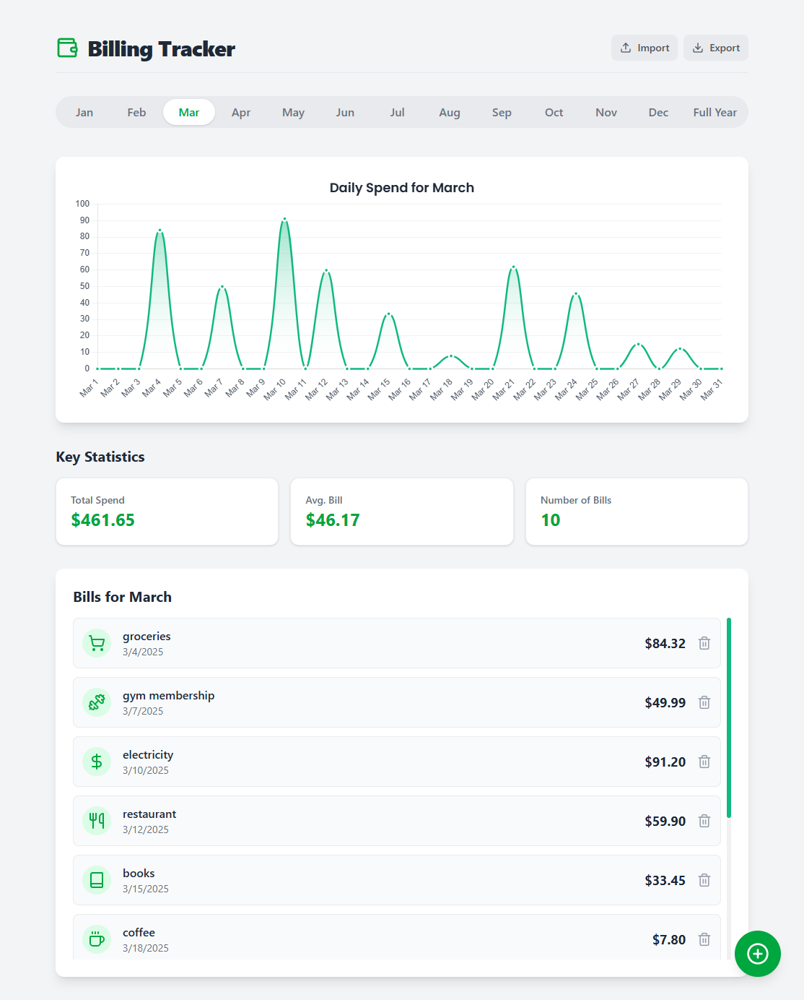

# 📊 Billing Tracker — React & Vite Edition

[](https://react.dev/)
[](https://vitejs.dev/)
[](https://tailwindcss.com/)
[](https://www.chartjs.org/)
[](./LICENSE)

**Billing Tracker** is a sleek, modern, and privacy-first personal finance web application built with React 19, Vite 7, and Tailwind CSS 4. It enables you to record, organize, and visualize your monthly and yearly expenses with rich interactive charts, granular category breakdowns, and instant search and filtering.

---

### 📸 Application Preview



---

## ✨ Key Features

### 🗂️ 10 Expense Categories & 55+ Curated Icons
- Comprehensive coverage across all personal finance areas:
  1. **Housing & Utilities** (Rent, Electricity, Water, Gas/Heating, Internet, Home Insurance, Waste)
  2. **Food & Dining** (Supermarket Groceries, Restaurants, Cafes, Delivery, Drinks)
  3. **Transportation** (Car, Fuel/Gas, Transit Bus, Metro/Train, Flights, Bicycle)
  4. **Health & Wellness** (Healthcare, Clinics, Prescriptions/Pharmacy, Fitness/Gym, Wellness)
  5. **Entertainment & Leisure** (Movies/Cinema, Streaming Services, Gaming, Music/Concerts, Event Tickets)
  6. **Shopping & Personal** (Retail Shopping, Clothing, Online Deliveries, Beauty/Personal Care, Gifts)
  7. **Technology & Subscriptions** (Mobile Plan, Laptop/Hardware, Cloud Storage/SaaS, Hosting, VPN)
  8. **Education & Learning** (University/Tuition, Textbooks, Online Courses, Career Training)
  9. **Finance & Investments** (Invoices/Bills, Fees, Credit Cards, Banking, Investments, Taxes)
  10. **Family & Pets** (Pet Care/Vet, Childcare, Baby Supplies)

### 📈 Interactive Spending Analytics
- **Dual Chart Modes:** Switch seamlessly between **Line Chart** and **Bar Chart** views.
- **Time Navigator:** Inspect spending trends across individual months or view a comprehensive **Full-Year** annual summary.
- **Multi-Year History:** Retain and switch between historical billing years with automated year detection.
- **Key Statistics Cards:** Instant at-a-glance metrics for **Total Spend**, **Bill Count**, and **Average Bill Amount**.

### 📊 Category Breakdown & Spending Share
- Real-time visualization of top spending categories.
- Category-themed progress bars and percentage share indicators to immediately spot your largest expense drivers.

### 🔍 Advanced Search, Filtering & Sorting
- **Instant Search:** Filter transactions live by title, category, icon, or dollar amount.
- **Category Filter:** Filter transactions down to specific categories via a clean custom dropdown.
- **Custom Sort:** Sort your ledger by **Newest First**, **Oldest First**, **Highest Amount ($)**, **Lowest Amount ($)**, or **Name (A–Z)**.
- **Grouped Full-Year View:** Automatically groups transactions by month in the full-year view with month-sticky headers.

### ✏️ Complete Bill Lifecycle (CRUD)
- **Add New Bills:** Quick modal entry with validation for positive amounts, date pickers, and category tab navigation.
- **Edit Bills:** Modify name, amount, date, and category icon with automatic category tab syncing.
- **Delete Confirmations:** Safe deletion backed by confirmation modal dialogs to prevent accidental loss.

### 💾 Local-First Privacy & Zero Server Dependency
- **100% Client-Side:** All data is stored directly in your browser's `localStorage` (`billingAppBills_v2`).
- **No Account Required:** No third-party servers, tracking, or external database required. Your personal finances stay strictly on your device.

### 🔄 Data Backup, Export & Import
- **Export to JSON:** Full structured export containing schema versioning, metadata, and timestamps.
- **Export to CSV:** Clean tabular export compatible with spreadsheet software like Microsoft Excel, Google Sheets, or Apple Numbers.
- **Drag & Drop JSON Import:** Import previous backups with an integrated validation engine that sanitizes data, detects anomalies, deduplicates IDs, and provides actionable error reports.

---

## 🗂️ Expense Categories Overview

| Category | Primary Lucide Icons | Typical Expenses |
| :--- | :--- | :--- |
| **Housing & Utilities** | `Home`, `Zap`, `Droplet`, `Flame`, `Wifi`, `Wrench`, `Trash2`, `ShieldCheck` | Rent, mortgage, electricity, water, gas, broadband, repairs |
| **Food & Dining** | `ShoppingCart`, `Utensils`, `Coffee`, `Pizza`, `Beer` | Supermarket, restaurants, morning coffee, takeout, nightlife |
| **Transportation** | `Car`, `Fuel`, `Bus`, `Train`, `Plane`, `Bike` | Auto payments, gasoline, commuter rail, flights, cycling |
| **Health & Wellness** | `Heart`, `HeartPulse`, `Stethoscope`, `Pill`, `Dumbbell`, `Activity` | Doctor visits, health insurance, pharmacy, gym subscriptions |
| **Entertainment & Leisure** | `Film`, `Tv`, `Gamepad2`, `Music`, `Ticket`, `PartyPopper` | Cinema, streaming services, games, live events, celebrations |
| **Shopping & Personal** | `ShoppingBag`, `Shirt`, `Package`, `Sparkles`, `Scissors`, `Gift` | Apparel, parcel orders, cosmetics, haircuts, holiday gifts |
| **Technology & Subscriptions** | `Smartphone`, `Laptop`, `Cloud`, `Globe`, `Lock`, `Headphones` | Phone plan, computers, cloud backups, web domains, VPN |
| **Education & Learning** | `GraduationCap`, `Book`, `BookOpen`, `Briefcase` | College tuition, courses, certifications, professional books |
| **Finance & Investments** | `Receipt`, `DollarSign`, `CreditCard`, `Wallet`, `Landmark`, `TrendingUp`, `FileText` | Credit card dues, taxes, bank fees, stock investments |
| **Family & Pets** | `PawPrint`, `Baby` | Veterinary bills, pet food, daycare, baby essentials |

---

## 🛠️ Tech Stack

| Layer | Technology | Description |
| :--- | :--- | :--- |
| **Runtime / Library** | [React 19](https://react.dev/) | Component architecture and state management |
| **Tooling & Bundler** | [Vite 7](https://vitejs.dev/) | Lightning-fast HMR and optimized production build pipeline |
| **Styling** | [Tailwind CSS 4](https://tailwindcss.com/) | Modern utility-first design with CSS theme tokens |
| **Charting Engine** | [Chart.js 4](https://www.chartjs.org/) + [react-chartjs-2](https://react-chartjs-2.js.org/) | Responsive canvas charts (Line & Bar modes) |
| **Icons** | [Lucide React](https://lucide.dev/) | Lightweight, consistent SVG icon set |
| **Code Quality** | [ESLint 9](https://eslint.org/) | Strict JavaScript and React Hooks linting |

---

## 🚀 Getting Started

Follow these steps to run the application locally on your machine.

### Prerequisites
- **Node.js**: Version `18.0` or higher
- **npm**: Version `9.0` or higher (bundled with Node.js)

### Installation

1. **Clone the repository:**
   ```bash
   git clone https://github.com/DanialZaree/billingTracker.git
   cd billingTracker
   ```

2. **Install project dependencies:**
   ```bash
   npm install
   ```

3. **Start the local development server:**
   ```bash
   npm run dev
   ```

   The server will start and provide both local and network URLs:
   - **Local URL:** `http://localhost:5173/`
   - **Network URL:** `http://<your-local-ip>:5173/` (accessible from mobile devices on the same Wi-Fi)

---

## 💻 Available Scripts

In the project directory, you can run:

| Command | Action |
| :--- | :--- |
| `npm run dev` | Starts the Vite dev server with Hot Module Replacement (HMR). |
| `npm run build` | Compiles and bundles production-ready assets into the `dist/` directory. |
| `npm run preview` | Spins up a local server to test the production bundle from `dist/`. |
| `npm run lint` | Runs ESLint across the codebase to check for syntax and style issues. |

---

## 📁 Project Structure

```text
billingTracker/
├── public/
│   └── favicon.svg              # Application SVG favicon
├── src/
│   ├── assets/                  # Static media assets (preview images)
│   ├── components/
│   │   ├── BillChart.jsx        # Chart.js visualization with Line & Bar mode toggling
│   │   ├── BillFormModal.jsx    # Add / Edit bill modal with categorized icon picker
│   │   ├── BillList.jsx         # Transaction ledger with search, category & sort controls
│   │   ├── CategoryBreakdown.jsx# Progress bars & spending share by category
│   │   ├── ConfirmModal.jsx     # Safe deletion confirmation dialog
│   │   ├── CustomSelect.jsx     # Accessible custom dropdown component
│   │   ├── Header.jsx           # App top bar with branding, export & import triggers
│   │   ├── IconComponent.jsx    # Dynamic Lucide icon renderer
│   │   ├── ImportModal.jsx      # Drag-and-drop JSON file import & schema validation
│   │   ├── KeyStatistics.jsx    # Summary KPI cards (Total Spend, Bills, Average)
│   │   ├── TimeNavigator.jsx    # Month tabs & Full-Year selection bar
│   │   └── Toast.jsx            # Action feedback toast notifications
│   ├── utils/
│   │   ├── chartConfig.jsx      # Chart.js component registration & styling
│   │   ├── exportImport.jsx     # JSON/CSV file generation & sample seed data
│   │   ├── helpers.jsx          # Currency formatters, date utils, ID generator
│   │   ├── icons.jsx            # 10 Categories, 55+ Lucide icon maps & helpers
│   │   └── validation.jsx       # JSON import schema validator & data sanitizer
│   ├── App.jsx                  # Master container, state orchestration & localStorage
│   ├── index.css                # Tailwind CSS imports and custom utility styles
│   └── main.jsx                 # Application DOM root mount
├── index.html                   # HTML entry point with metadata and SEO tags
├── package.json                 # Project dependencies and npm scripts
├── tailwind.config.js           # Tailwind configuration
└── vite.config.js               # Vite bundler and dev server configuration
```

---

## 📄 License

Distributed under the **MIT License**. See `LICENSE` for more information.
